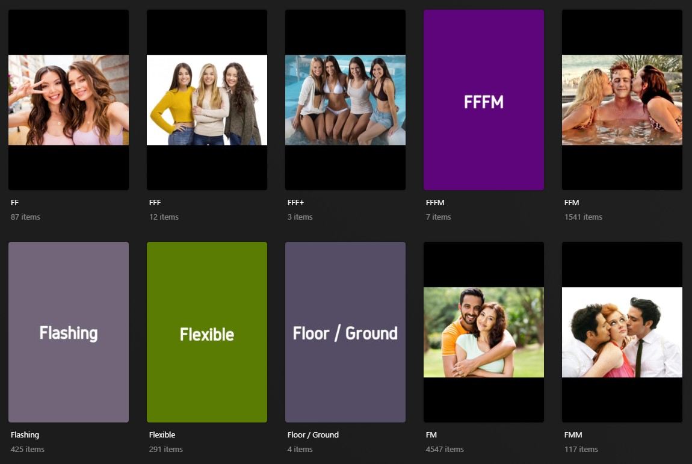
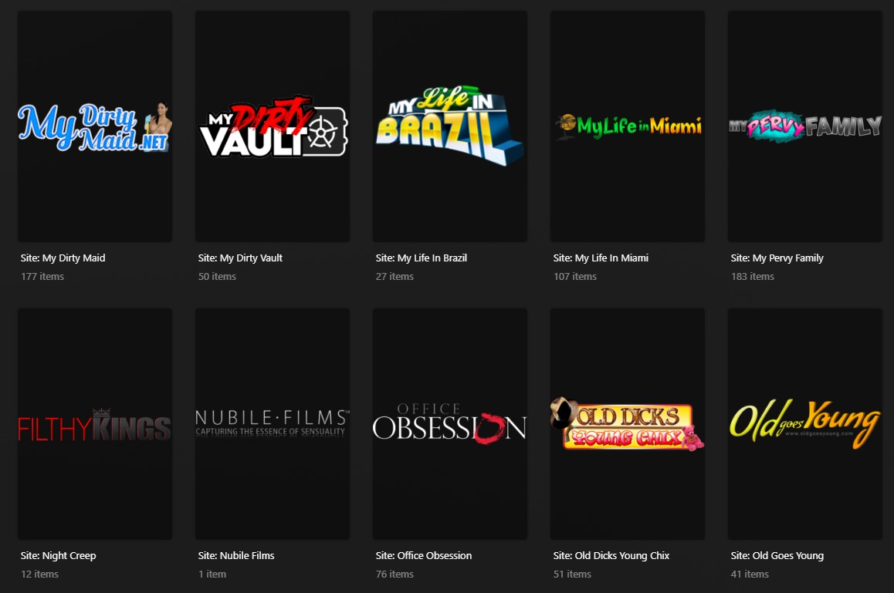

# Sync_Stash_Icons
Sync Tag and Site images from StashApp instance to Plex Collections

This is a very simple Python script to copy and convert images in a Stash instance down to Plex collections.

It will take the images for tags and sites from Stash, then walk through all of the Plex collections in the Library that you have defined.  
If the title of the tag/site matches the title of the collection then it will resize the Stash image down to fit into a 500x750 poster.
That image will be saved to the output directory and then uploaded to Plex.  The images aren't deleted from the output folder in case you'd 
like to review them later.

If there is no image in the Stash server then the script can create a 500x750px image with the title of the collection stamped into the center
of the poster.  The background color is completely random, but should only pick a darker color so that the white text is readable.  This is the 
default behavior.

This script has all the elegance of an elephant on roller skates, and runs about as fast.  Other systems might be quicker than mine, but
it does take a few seconds per tag/site for me since it has to download the file from Stash and then upload it to Plex...  but it works, 
so there's that.

A few caveats:

1) If you use SVG format images, the script can convert them to PNG for Plex.  However the SVG library cannot handle gradient colors, so that will
not yield expected results.  Also it will default to white as the image color, which can cause problems with logos.  Essentially give it a shot but
it might not look great

2) For Site collections there should be some text added to the site/studio name to mark it in collections.  I use "Site:", so my collection would
   show as "Site: Nubile Films".  Without something like that the script won't  be able to differentiate if it should be looking for a site or a tag.
   I can change this if it's a problems, but wanted to put that out there.

3) Before I'm asked, you apparently cannot change the images for the "Categories" tab.

4) Stash authentication is not currently coded or supported.  This includes both user/pass as well as API authentication

   Questions or comments you can reach me on the TPDB Discord at https://discord.gg/rj9ATCVj or the Stash discord at https://discord.gg/rj9ATCVj

**Screenshots:**

*General Tags, With and Without Stash Images:*

*Site Logos:*

